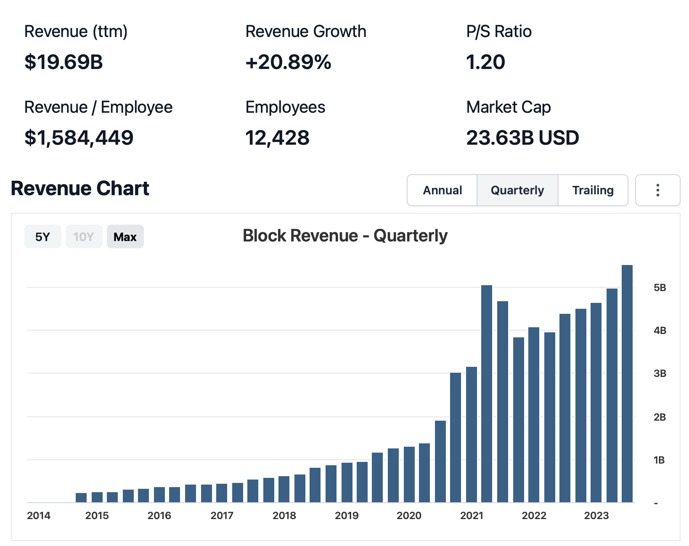
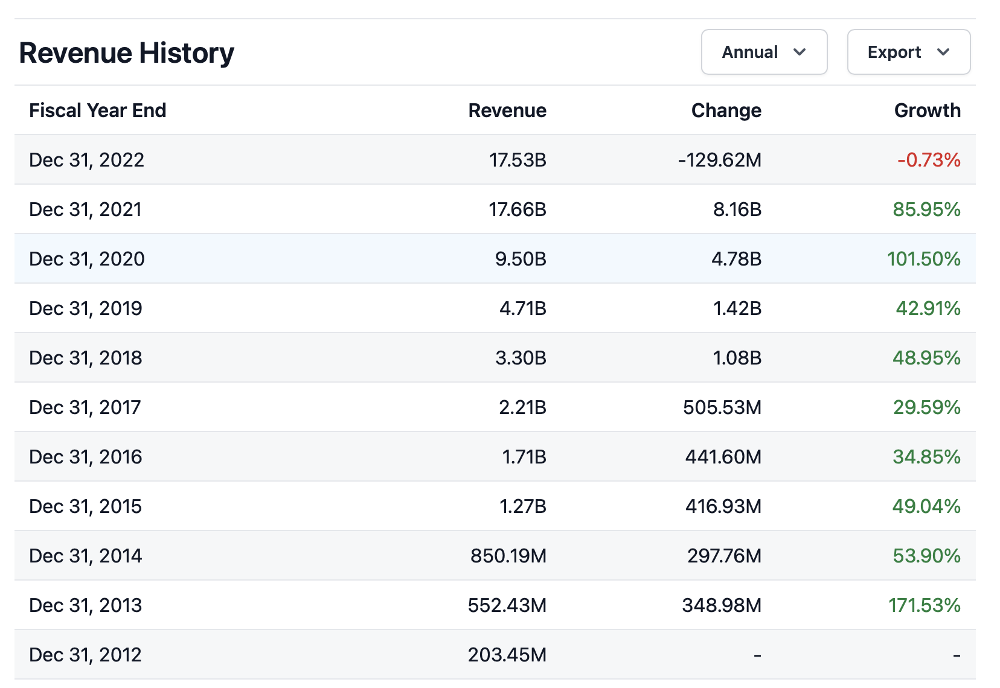

# Block empire

## Inspiration 
Block Inc. (formerly Square Inc) was founded in February 26, 2009, by Jack Dorsey and Jim McKelvey. 
In 2009, Jim McKelvey, a glassblower and artist, was unable to complete a $2000 sale for one of his art pieces because he couldn't accept credit card payments. This experience led to the idea of creating a simple and accessible way for small businesses to accept card payments. Jim McKelvey approached his friend Jack Dorsey with the idea. Jack Dorsey, who was already well-known as one of the co-founders of Twitter, became interested in the concept. Together, they co-founded Square, Inc. Square's initial product was a small, square-shaped device that could be plugged into the headphone of a smartphone or tablet, turning it into a card reader. This device allowed businesses and individuals to accept card payments on their mobile devices. Square has since grown into a major financial services and mobile payment company, offering a wide range of products and services beyond card readers, including point-of-sale software, business financing, and more.
[Block, Inc](https://block.xyz)

## Funding
Jack Dorsey and Jim McKelvey, the co-founders, invested their own money to get the company off the ground. This personal investment provided the initial capital needed for product development and early operations. Square attracted venture capital funding to support its growth. These investors provided additional funding in exchange for equity in the company. Square went through several rounds of financing to raise capital for expansion and development. In 2009, Square raised 10 million dollars in Series A, in 2010 raised 27.5 million dollars in Series B. In 2012 Square announced partnership with Starbucks, which included 25 million dollars investment and an agreement to accept Square's payment system in Starbucks stores. This investment provided Square with exposure to a large customer base. In 2015, Square when public with it's IPO, raising $243 million by selling shares to the public. The company was valued at around $2.9 billion at the time of it's IPO
## Business Activities:
### Square 
Square, Inc. was founded to address financial challenges and make financial transactions more accessible and convenient for individuals and small businesses. They aim to solve problems such as limited access to card payments, high transaction costs, lack of modern point-of-sale systems, access to financing, financial inclusion, and online payments. Square's mission is empower small businesses, and simplify financial transactions through innovative and cost-effective solutions.
Many small businesses and individuals had limited access to accepting card payments. Square solved this problem by providing an affordable and user-friendly solution for accepting credit and debit card payments through mobile devices. Traditional credit card processing systems often involved high fees and complex contracts. Square sought to simplify the fee structure and make it more transparent, with flat-rate pricing, so that small businesses could better predict and manage their transaction costs. Many small businesses didn't have access to modern point-of-sale systems that could help with inventory management, sales analytics, and other business operations. Square provided software and hardware solutions to address this issue. Square also aims to help small businesses access financing through services like Square Capital. By analyzing transaction data, Square could offer loans to businesses that may have had difficulty securing traditional bank loans. Square's solutions targeted financial inclusion by allowing individuals and businesses, particularly those in underserved communities, to participate more fully in the digital economy. This helped bridge the gap between those with and without access to modern financial tools. Square expanded its services to include solutions for online and e-commerce payments, allowing businesses to process payments over the internet seamlessly. As of 2020, more than 64 million businesses use Square to facilitate credit card payments.
[Square](https://squareup.com/us/en)
### CashApp
Cash App solve specific financial challenges, including enabling peer-to-peer payments, offering access to banking services through a debit card, facilitating investing in stocks and Bitcoin, providing cashback rewards, offering tax filing tools, enabling direct deposit, and promoting financial inclusion. Cash App simplifies financial transactions and help users to manage their money and make payments more conveniently. Cash App allows users to easily send and receive money from friends and family. It simplifies the process of splitting bills, paying for shared expenses, or sending money to someone quickly. Cash App provides users with a Cash Card, which is a debit card linked to their Cash App account. This card allows users to make purchases, withdraw cash, and access their funds without the need for a traditional bank account. It helps those who may be underbanked or have limited access to traditional banking services. Cash App offers the ability to invest in stocks and Bitcoin. This feature allows users to access investment opportunities and build wealth without requiring a traditional brokerage account. Cash App provides users with cashback rewards through its Cash Boost program. Users can get discounts and cashback on purchases made with their Cash Card, helping them save money. Cash App offers users to round-up fraction of dollar and automatically save or invest that money on purchases made with debit card. Users can have their paychecks directly deposited into their Cash App accounts, which can be especially useful for those who may not have access to traditional bank accounts. Cash App promotes financial inclusion by providing a platform where people with limited access to traditional financial services can manage their money, send and receive payments, and invest. Cash App is designed to provide a user-friendly, accessible, and versatile financial tool that helps individuals manage their money, make payments, invest, and access banking services, even if they are underbanked or looking for a more convenient way to handle their financial needs.
Over 50 million people use Cash App, almost all users are based in the US and has potential to grow internationally. 
[Cash App](https://cash.app/)
### Bitcoin (Spiral and TBD)
Bitcoin is a decentralized digital currency created in 2009 by an anonymous entity known as Satoshi Nakamoto. It operates on a secure blockchain network, with a fixed supply of 21 million coins. Bitcoin is not controlled by any central authority and is highly divisible. It is known for its price volatility and is used for various purposes, including as a store of value, a medium of exchange, and an investment. Bitcoin is global and borderless, allowing for cross-border transactions. It has garnered significant attention and debate in the financial world and continues to evolve in its adoption and use.
Spiral and TBD are two initiatives under the Block’s umbrella that focus entirely on Bitcoin. While Spiral is dedicated to building and funding “open-source projects aimed at making bitcoin the planet’s preferred currency,” TBD is currently focused on developing a decentralized bitcoin exchange. Making the decentralized financial world accessible – for everyone. 

[Spiral: "Making bitcoin more than an investment."](https://spiral.xyz/)

[TBD: "Decentralized and trustless systems create a world that empowers individuals".](https://www.tbd.website/)
### Tidal
Tidal's primary focus is to address what it perceives as a fairness problem in the music industry regarding artist compensation. Tidal aims to solve the relatively low payouts to artists and musicians from music streaming services, especially when compared to the revenue generated by these platforms. The music industry traditionally faced challenges with low artist compensation, and the shift to digital streaming services raised concerns about how musicians are paid for their work. Tidal has positioned itself as a platform that pays higher royalties to artists compared to some other streaming services and advocating for fair pay.
[Tidal: "Stream with purpose".](https://tidal.com)
### Weebly
Weebly is a website building and hosting platform that provides individuals and businesses with the tools and services needed to create and manage websites, blogs, and online stores. 
### Afterpay
Afterpay is a leading "Buy Now, Pay Later" service that enables consumers to make purchases and pay for them in interest-free installments.

## Diversity, Investments and Growth
Block, Inc is founder lead, company with a diverse range of businesses within the financial technology sector. Block has reported substantial revenue growth over the years, reflecting its expanding range of financial services, including payment processing, point-of-sale solutions, business financing, the Cash App, and more. Its growth and diversification have positioned it as a prominent player in the industry. in October 2020, Block made a significant investment in Bitcoin by purchasing approximately 4,709 Bitcoins for $50 million. Block has continued to accumulate Bitcoin as part of its corporate treasury strategy. The company has expressed its intent to hold Bitcoin as a long-term asset. Cash app integrated Lightning Network, The Lightning Network is a second-layer scaling solution for Bitcoin, designed to facilitate faster and cheaper Bitcoin transactions. Potentially Block could build payment rails on Bitcoin second layer bypassing industry giants like Visa, MasterCard, Amex and help save money on transactions. 

## Future of Bitcoin mining
Bitcoin mining is the process by which new Bitcoins are created and transactions on the Bitcoin network are verified and added to the blockchain, which is the public ledger of all Bitcoin transactions. Block increasingly becoming a Bitcoin company and moving toward to help secure the network and decentralization. Block has posted a new blog that details the Mining Development Kit, a new project that would seemingly replicate the Lightning Development Kit and Bitcoin Development Kit projects, providing developers access to bitcoin mining projects focused on integrating bitcoin mining into various novel use cases. The blog also describes how the company has started developing their own bitcoin mining semiconductor chips, saying that “These purpose-built application specific integrated circuits (ASICs) are the leading way bitcoin is mined today and will serve as the foundation for a full suite of bitcoin mining products intended to increase the pace of innovation in bitcoin mining.” I would recommend to build a home appliances that come with build-in ASIC's making Bitcoin more decentralized and help individuals to pay utility bills with quietly mined Bitcoin rewards and transaction fees. 

## Competition
### Intuit 
Intuit, the maker of QuickBooks, offers financial and accounting software with integrated payment processing capabilities. It is a competitor for businesses seeking all-in-one solutions.
### PayPal  
PayPal competes with Square in the mobile payment processing space. It offers services like PayPal Here for in-person payments and Venmo for peer-to-peer payments.
### Stripe 
Stripe is a major player in online payment processing, providing services for e-commerce businesses. 
### Shopify 
Shopify is a popular e-commerce platform that offers its own payment processing services. 
### Clover 
Clover, owned by Fiserv, is a direct competitor in the point-of-sale market. It provides POS hardware and software solutions for businesses, similar to Square's offerings.
### Affirm
Affirm is a financial technology company that provides a "buy now, pay later" platform.
### Coinbase and Kraken
Coinbase is a prominent cryptocurrency exchange and platform that allows users to buy, sell, and store Bitcoin and other cryptocurrencies.
### Apple pay and Google pay
Apple Pay is Apple's mobile payment service that allows users to send money to others through iMessage. It also offers contactless payments and is integrated with Apple devices.
Google Pay offers a mobile payment platform that includes peer-to-peer payment capabilities. Users can send money to friends and family, make contactless payments in stores, and manage their payment methods.
### M1 Finance
M1 Finance platform that provides investment and wealth management services to users. It offers a unique combination of robo-advisory features and self-directed investing, allowing users to create and customize their investment portfolios.
### SoFi
SoFi, short for "Social Finance," offers a range of financial services and products to its users. Originally founded to help people refinance student loans, SoFi has expanded its offerings to cover various aspects of personal finance.
### Spotify
Spotify is a widely recognized music streaming service and media platform that offers a vast catalog of songs, podcasts, and other audio content. 

### Sources
[Google](https://www.google.com)
[Wikipedia](https://en.wikipedia.org/wiki/Block,_Inc.)
[Bitcoin Magazine](https://bitcoinmagazine.com/tags/block-inc)

